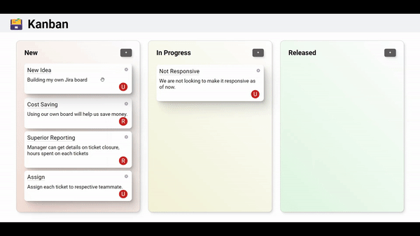
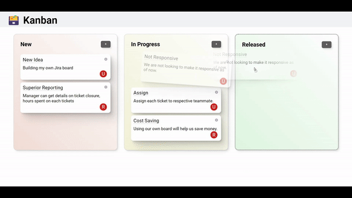

# Kanban

This project is a Kanban (Jira type) Project management app built with Vue 3 and typescript. It is designed to help you manage your projects more efficiently.

## Screenshots




## Beta 1 (Done)

UI design and building frontend.

## Beta 2 (Yet to deploy)

Adding supabase/firebase as database.

## Beta 3 (Pending)

Configuring Authentication system for login/sign up page.

## Release (Pending)

Releasing for public after adding Jest test cases.

## Recommended IDE Setup

[VSCode](https://code.visualstudio.com/) + [Volar](https://marketplace.visualstudio.com/items?itemName=Vue.volar) (and disable Vetur) + [TypeScript Vue Plugin (Volar)](https://marketplace.visualstudio.com/items?itemName=Vue.vscode-typescript-vue-plugin).

## Usage

1. Open the app in your browser.
2. Use the app to manage your projects.

## Customize configuration

See [Vite Configuration Reference](https://vitejs.dev/config/).

## Project Setup

```sh
npm install
```

### Compile and Hot-Reload for Development

```sh
npm run dev
```

### Compile and Minify for Production

```sh
npm run build
```

## Description of the project

This project is built with Vue 3 and typescript. Vue is an amazing lightweight, progressive frontend framework that provides first-class TypeScript support. TypeScript is a superset of JavaScript that adds optional static typing and other features to the language.

The project is designed to help you manage your projects more efficiently. It allows you to create tasks, assign them to team members, track their progress, and more.
